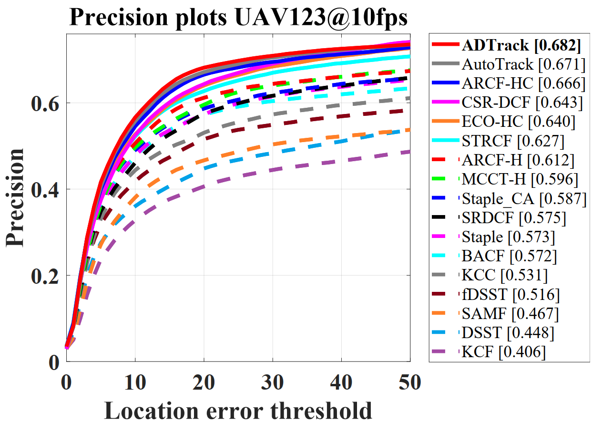
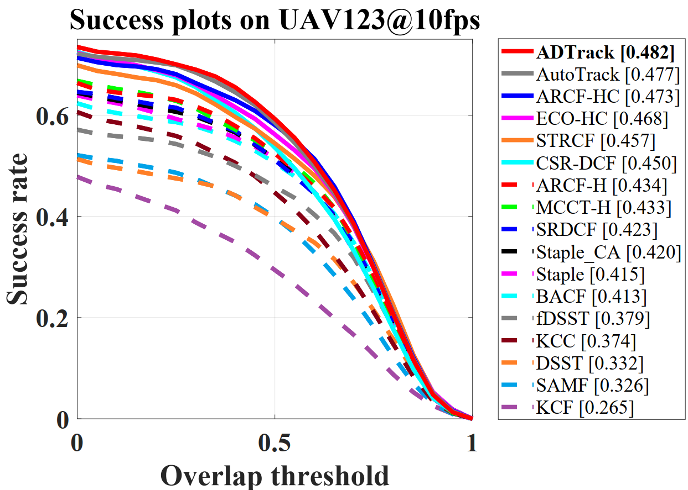
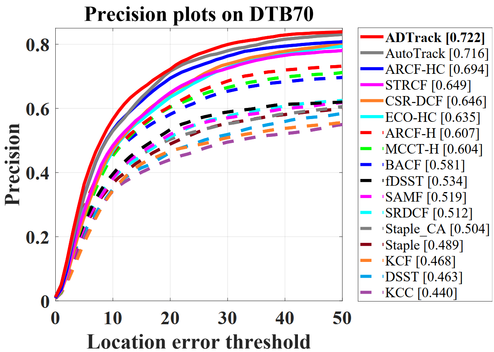
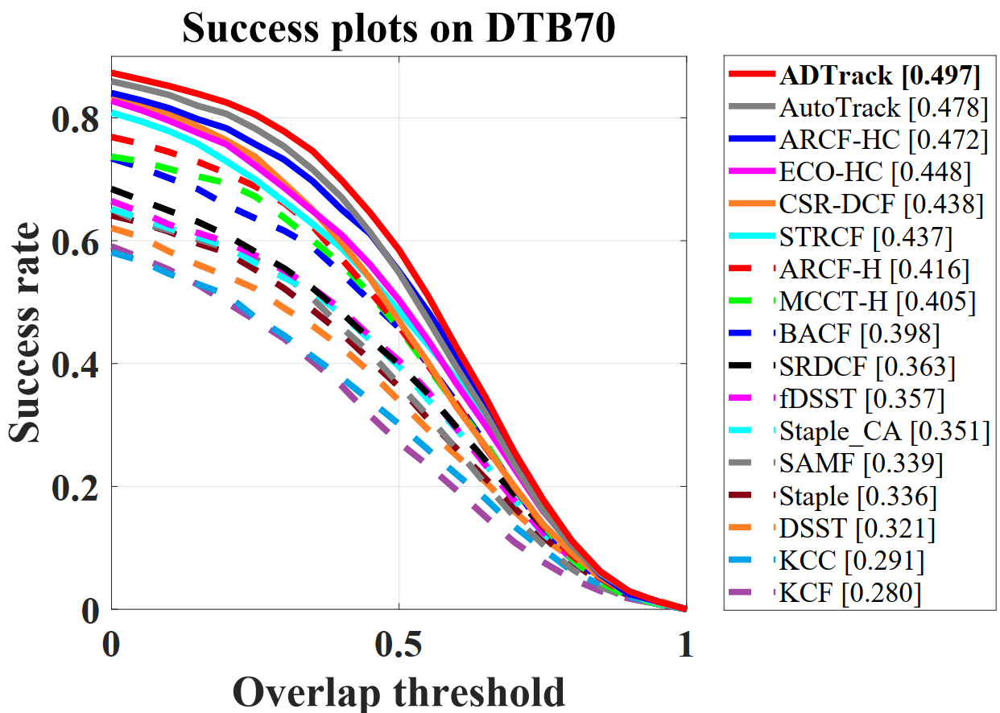
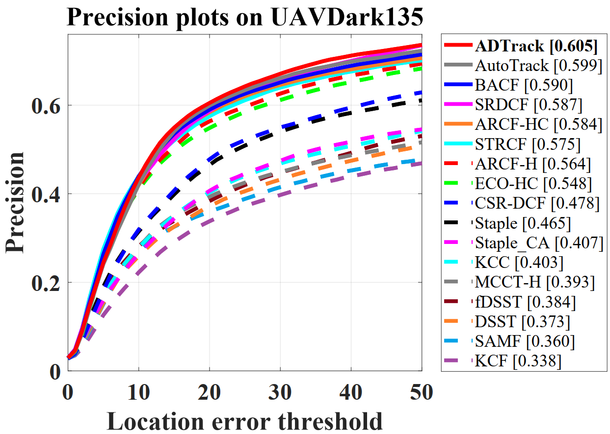
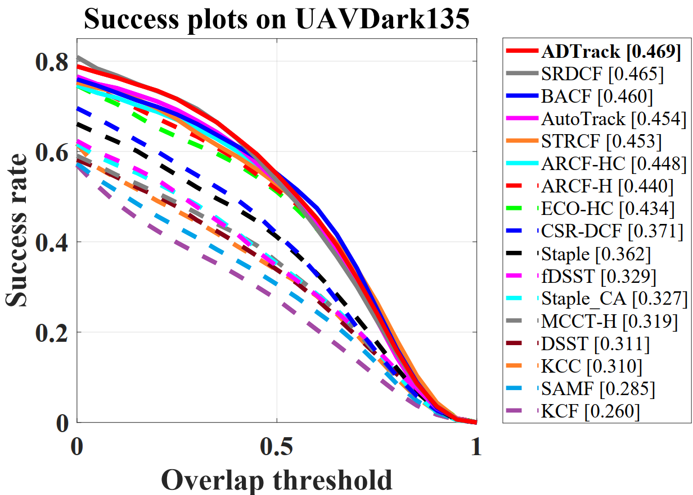
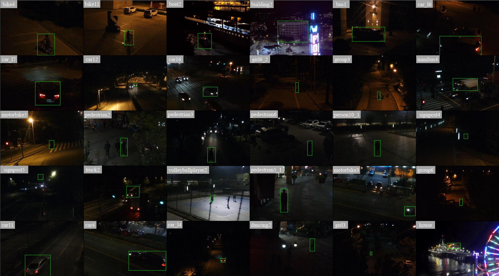

# All-Day Object Tracking for Unmanned Aerial Vehicle 
Matlab implementation of our Real-time illuminative adaptive Anti-Dark tracker (ADTrack).

# Abstract

Visual object tracking, which has facilitated numerous applications, is representing a major interest in image signal processing field. Among which, equipping unmanned aerial vehicle (UAV) with all-day real-time robust visual trackers, is currently attracting incremental attention and has remarkably broadened the scope of applications of object tracking. However, prior tracking methods have merely focused on robust tracking in the well-illuminated scenes, while ignoring UAV's satisfying tracking in the dark. In darkness, the conditions can be more complex and harsh, easily leading to inferior robust tracking or even tracking failure. To this end, this work proposed a novel tracker with illumination adaptive and anti-dark capacity (ADTrack), which is based on discriminative correlation filter. ADTrack firstly exploits image illuminance information to enable adaptability to the given light condition. Then, by virtue of an efficient and effective image enhancer, ADTrack carries out image pretreatment, where a target-aware mask is generated. Benefiting from the mask, ADTrack aims to solve a dual regression where dual filters, *i.e.*, the context filter and target-focused filter, are trained with mutual constraint. Thus ADTrack is able to maintain continuously favorable performance in all-day conditions. Besides, this work also constructed the very first UAV nighttime tracking benchmark UAVDark135, comprising of more than 125k manually annotated frames, which is also the biggest UAV tracking benchmark. Exhaustive experiments are extended on authoritative daytime benchmarks, *i.e.*, UAV123@10fps, DTB70, and newly built dark benchmark UAVDark135. Results have validated the superiority of ADTrack in both bright and dark conditions compared with other arts. Meanwhile, ADTrack realizes a real-time speed of over 30 frames/s on a single CPU, greatly promoting UAV's all-day robust tracking.

# Contact

Bowen Li

Email: 1854152@tongji.edu.cn

Changhong Fu

Email: [changhongfu@tongji.edu.cn](mailto:changhongfu@tongji.edu.cn)

# Demonstration running instructions

This code is compatible with UAV123@10fps, DTB70 and UAVDark135 benchmark. Therefore, if you want to run it in benchmark, just put ADTrack_v2 folder in trackers, and config sequences and trackers according to instructions from aforementioned benchmarks. 

If you want to use our experimental results, UAVDark135 benchmark or related content, please cite our paper using the format as follows:

@article{Li2021All,

author = {Bowen Li and Changhong Fu and Fangqiang Ding and Junjie Ye and Fuling Lin},

title = {All-Day Object Tracking for Unmanned Aerial Vehicle},

year = {2021},

journal = {arXiv:2101.08446}

}

# Results on UAV datasets

### UAV123@10fps

### DTB70

### UAVDark135

# Benchmark UAVDark135

**UAVDaark135** is a newly constructed **UAV dark tracking** benchmark, containing totally 135 sequences. It covers a large variety of scenes, including street, crossing, T-junction, lakeside, highway, ocean, *etc*.

Here exhibits some representative scenes from UAVDark135:

The benchmark is available at:

https://pan.baidu.com/s/1JcV_wTUSt9F8iBXiLCZQdQ 

extraction code：axci 

# Acknowledgements

We thank the contribution of  H. K. Galoogahi, Ning Wang and Martin Danelljan for their previous work BACF,  MCCT-H and DSST.  The feature extraction modules and some of the parameter are borrowed from the MCCT tracker (https://github.com/594422814/MCCT). The scale estimation method is borrowed from the DSST tracker (http://www.cvl.isy.liu.se/en/research/objrec/visualtracking/scalvistrack/index.html).

